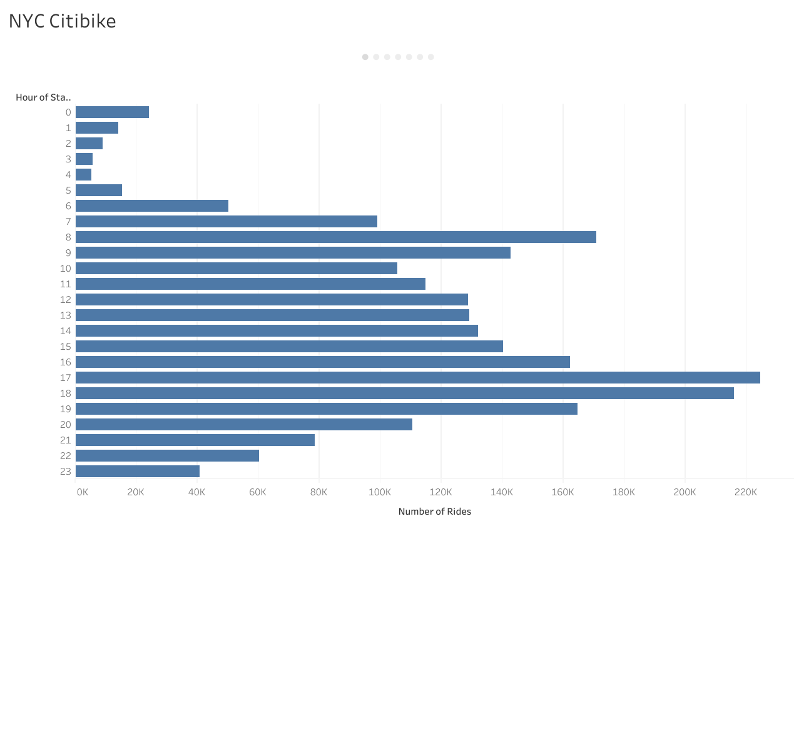
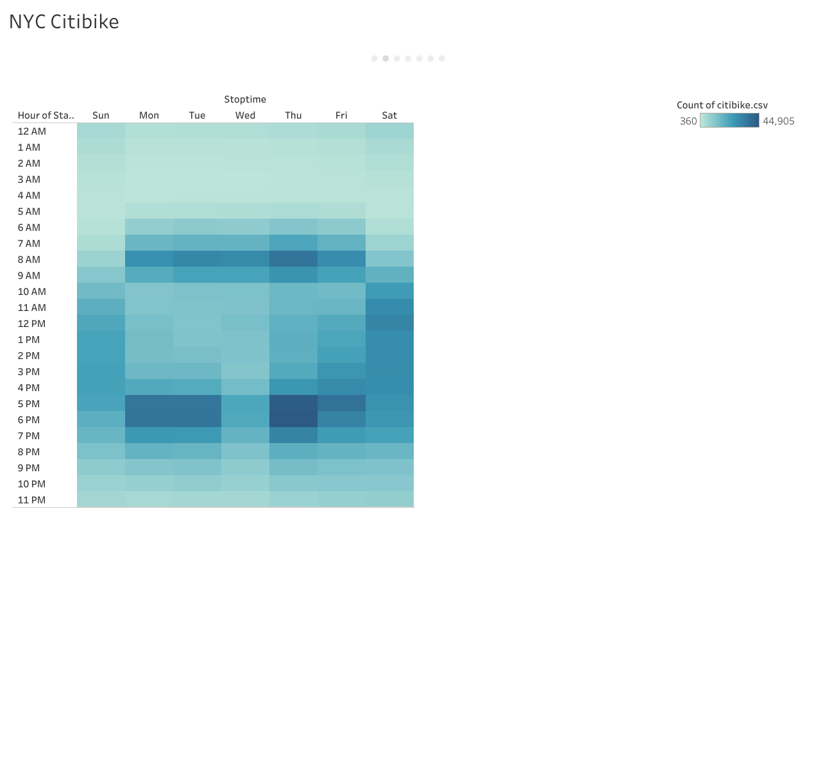
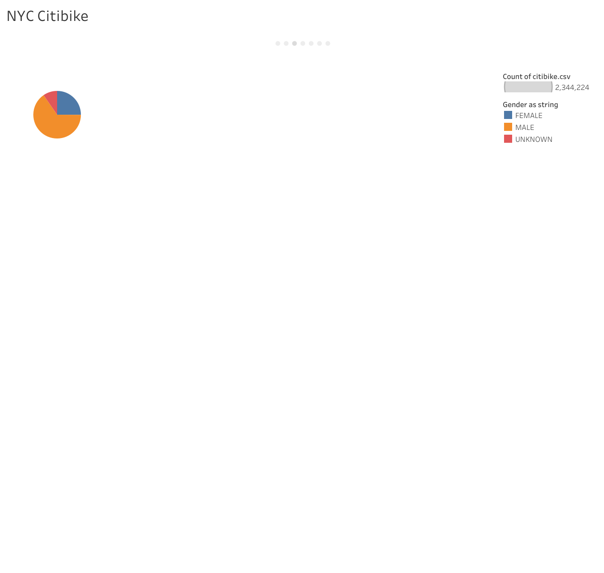
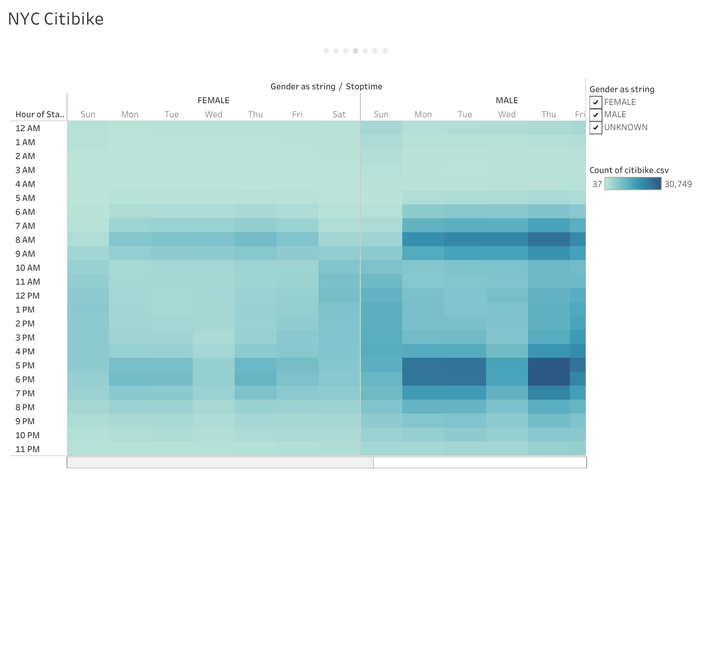
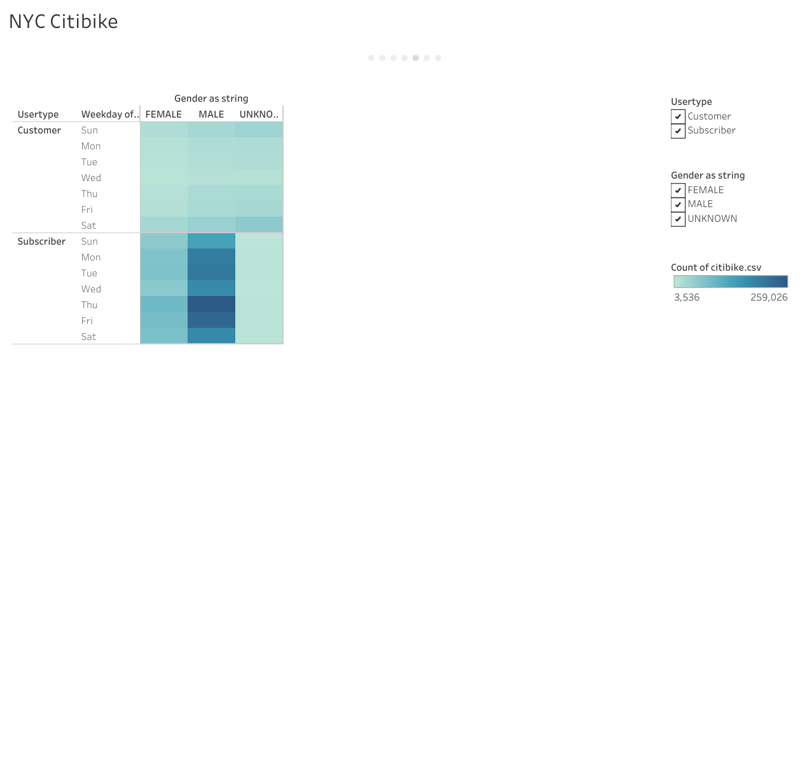
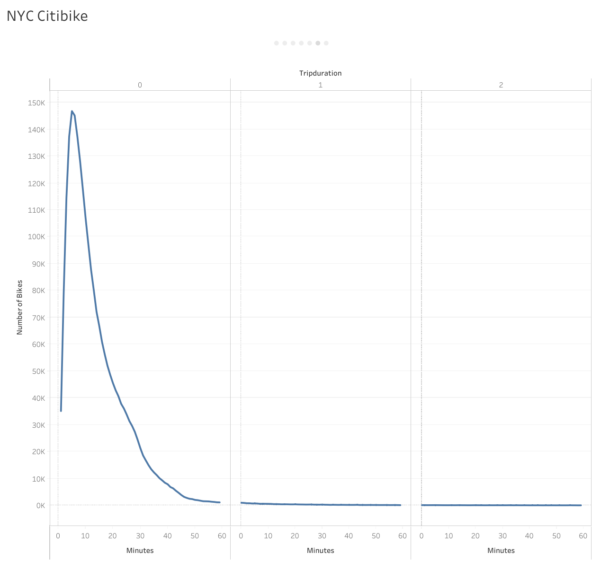
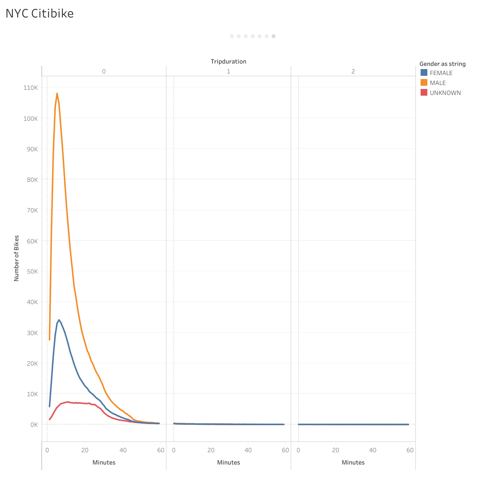

# bikesharing

## Overview
The purpose of this project was to characterize aspects of bikeshare data in New York City. Data from Citibike in August of 2019 was analyzed.

## Results
The analysis was performed in Tableau and can be viewed [here](https://public.tableau.com/app/profile/matthew7245/viz/bikeshare_challenge_16768600119540/NYCCitibike?publish=yes).

First, we looked at the most popular times to use Citibikes. The number of rides was highest around 7-8am and 5-6pm, not surprisingly correlated with standard commuting times.

We then broke this down by day of the week and found this pattern to be consistent for Mon-Fri (also not surprising).

Next we wanted to look at the gender distribution of Citibike users. It is unfortunately male dominated.

The distribution of popular riding times appears to be roughly the same between males and females.

The most represented users for all days of the week are male subscribers.

I think this graph looks stupid, but basically most the trip duration of most rides is around 10 minutes.

We see a similar patter for all genders.

## Summary
Overall, most of the results are not particularly interesting and probably could have been guessed by any rational human, or exceptionally rational non-human. It seems as though bikesharing is used primarily for commuting, and the users are predominantly male. An additional visualation showing the most popular routes overlayed on city infrastructure (roads, bike lanes, etc.) would be useful for planning the distribution of bikes. Further, displaying routes by gender could elucidate the disproportionate gender representation and help increase usage across all genders.